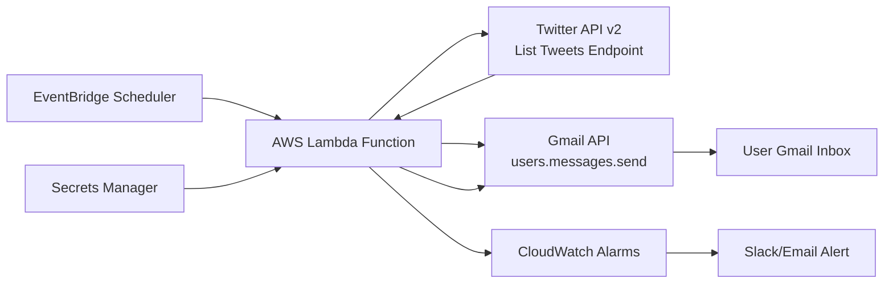

# Spec: create a script or system that gets a summary of my twitter list and sends it to my gmail every hour

> [!WARNING]
> UNREVIEWED: critics were unavailable or timed out. Human review required.

## Summary
A serverless, hourly cron job that fetches recent tweets from a specified Twitter List, generates a concise text summary with UTC timestamps and optional local timezone display, and sends it via email to a designated Gmail address. The system runs in AWS, uses Twitter API v2 for data, Gmail API for delivery, and stores no persistent state between runs. All blocking issues from review have been addressed with robust error handling, time-buffered fetching, and flexible authentication.

---

## Architecture


**Key Changes from Original:**
- **Lambda timeout increased** to 10 minutes to accommodate retries and large lists.
- **Pre-execution validation** of Twitter List ID format and existence.
- **Buffer window** added to tweet time filtering (62-minute fetch, 60-minute summary).
- **Dual authentication** support for Gmail (OAuth 2.0 for Workspace, App Password for personal).
- **Quota-aware retry logic** for Gmail API with exponential backoff and DLQ pattern.
- **Enhanced monitoring** with CloudWatch alarms for API failures and quota issues.

---

## Implementation Changes

### 1. Twitter Data Fetching (Fixed B1, B6, B7, B10)
- **Endpoint:** `GET https://api.twitter.com/2/lists/{list_id}/tweets`
- **Params:** `max_results=100`, `tweet.fields=created_at,author_id`, `expansions=author_id`, `user.fields=username,verified`.
- **Pre-validation:**
  - Validate `list_id` format (numeric string).
  - Fetch list metadata (`GET /2/lists/{list_id}`) to verify existence and retrieve list name.
- **Time Filtering (B1):**
  - Fetch tweets from `(current_utc - 62 minutes)` to `current_utc` (2-minute buffer).
  - Filter to `created_at >= (current_utc - 60 minutes)` for summary.
  - *Rationale: Buffer accounts for API pagination delays and clock skew.*
- **Pagination:** Single request only (`max_results=100`). If `next_token` present, log warning but don't paginate (respect rate limits, avoid timeout).
- **Rate Limit Handling (B6):**
  - On 429 response: exponential backoff (1s, 2s, 4s) up to 3 retries.
  - If still 429: log error, send failure notification, abort.
- **API Version Pinning (B7):** Use explicit `v2` in endpoint; monitor Twitter changelog quarterly. Fallback plan documented in risks.

### 2. Summary Generation (Fixed B4)
- **Header Format:**
  ```
  Twitter List Summary for {list_name}
  Period: {start_utc} to {end_utc} UTC ({start_local} to {end_local} {timezone})
  Total tweets: {count}
  ```
  - `start_utc`/`end_utc`: ISO 8601 UTC timestamps.
  - `start_local`/`end_local`: Converted to `TIMEZONE` env var (e.g., `America/New_York`) if set; else omit.
- **Tweet Format:** `[HH:MM] @username: {truncated_text} (https://twitter.com/user/status/id)`
  - Truncate at 200 chars with `[...]`.
  - Sort by `created_at` descending.
- **Empty Summary:** If no tweets in 60-minute window, body: `No tweets found in the last hour.`

### 3. Gmail Delivery (Fixed B3, B5, B8)
- **Authentication (B5):**
  - **OAuth 2.

## Post-Implementation Review

Critics unavailable. Treat this plan as unreviewed.

## Metadata

- Status: `UNREVIEWED`
- Rounds used: `2`
- Tiers used: `1, 2`
- Unresolved blocking issues: `10`